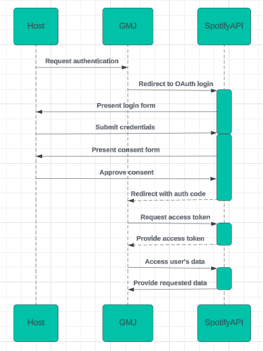

# Spotify Shared Sessions Application

## Prerequisites
1. **[Docker Desktop](https://www.docker.com/products/docker-desktop/)** installed on your system
2. Access to a Spotify Premium account (Spotify API Player calls require this)

## Getting Started

To begin, clone the official github repository
> git clone https://github.com/michiganhackers/spotify-open-source-proj.git

or navigate to your local repository and pull latest changes.

### <a name="postgresql-setup"></a>PostgreSQL Setup
Download [Docker Desktop](https://www.docker.com/products/docker-desktop/) if you don't already have it installed.

Pull the official docker image of postgres version 14.5 on your machine by running:

> **docker pull postgres:14.5**

Create a .env file at the top level of your directory and store environment variables for PG_USER and PG_PASSWORD.

Make sure your path is set to the top level of this directory, then run **pg_startup.sh** in your terminal using:

> **./pg_startup.sh**

If you are getting 
> **bash: Permission Denied**

try running 
> **chmod +x pg_startup.sh**.

Then rerun
> **./pg_startup.sh**

This should spin up a docker container preset for postgresql that you will use for development of the application.

### Set Up Spotify Development App

1. Please navigate to the [Spotify Developer Dashboard](https://developer.spotify.com/dashboard)
2. Create an account if needed
3. Select Create App
4. Give your app a name (ex: GMJ Dev App) and a description. For the website portion, input http://localhost:3000, and for redirect URIs, input http://localhost:3000/api/spotify/getToken. Select Web API for the API you want to use. Then create app.
5. Finally, navigate to the app you just created, select settings, and be ready to copy the client id and client secret into your .env file in the next step.

### Define .env File

Your .env file should be located at the top-level of your project directory. Inside, please define the following variables to be used throughout the application.
```
PG_URI="postgres://dev:<your-password>@localhost:5432/dev"
PG_USER="dev"
PG_PASSWORD="<your-password>"

APP_SERVER="http://localhost:3000"
WS_SERVER="http://localhost:8080"
WS_STARTUP="node --loader ts-node/esm src/socket/server.ts"

NEXT_PUBLIC_SPOTIFY_CLIENT_ID="<your-spotify-client-id>"
SPOTIFY_CLIENT_ID="<your-spotify-client-id>"
SPOTIFY_CLIENT_SECRET="<your-spotify-client-secret>"
```

### Next.js Application Setup

Install dependencies:

```
npm i
```

Run the development server:

```bash
npm run dev
# or
yarn dev
# or
pnpm dev
# or
bun dev
```

Open [http://localhost:3000](http://localhost:3000) with your browser to see the result.

### Websocket Server Setup

Finally, we need to run our websocket server on a seperate port as our application server. To do so, in a seperate terminal run:

```
node --loader ts-node/esm src/socket/server.ts
```

Now you should have a websocket server running on http://localhost:8080.

## Architecture

Green Monster Jelly is built on the [Next.js React framework](https://nextjs.org/), and takes advantage of its ability to seperate Server-side and Client-side rendering. By default, all modules within the src/app/ directory utilize SSR (Server-side rendering), however modules may still be rendered on the client side with the 'use client' directive. This is particularly useful in reducing the overall bundle size sent to clients, as well as increasing security of sensitive data that could be passed around otherwise (access_token, environment variables, etc.).

### Who's talking to who?

There are three central nodes for transmitting data throughout the application, as well as the additional communication link with Spotify's Web API service. 

#### 1. Client

The responsibility of the client is to provide a web interface for which users can visualize and interact with their session's data. The client will talk both with the Next.js server (to make api calls specific to the application), and to the Websocket Server (for receiving real-time updates from the Spotify queue).

#### 2. Next.js Server

The responsibility of the server is to maintain and arbitrate the state of a given session (as well as to serve front-end files that will be used by the client, but this is all done behind the scenes with Next so no need to worry too much about this). This means that any call that will interact with a user's Spotify queue must travel through the Next.js server via one of its api endpoints (defined in /api/spotify/). In addition to this, the server provides clear methods for initializing and connecting to sessions (/api/sessionDB/{connect | create}). This also means that the Next.js server is responsible for the destruction of said sessions and any related clean up calls to the database ** yet to be implemented **.

#### 2.1. Database!!
Speaking of the database, a dedicated library of database focused functions are defined within the /database/db.ts file. These functions are available for access by both the Next.js server and its Websocket counterpart, but should **not** be utilized within any direct client component. In addition to this, you will find the schema of said database is accessible within the /database/ directory.

For development in a local environment, setting up your database for development should be as simple as running **./pg_startup.sh** (more info [here](#postgresql-setup)).

#### 3. Websocket Server

In addition to the Next.js server, Green Monster Jelly also utilizes the Websocket protocol to enable minimal overhead, real-time (or relatively real-time) updates to a clients' User Interfaces when the Spotify queue is mutated.

The reason behind this decision stems from a quite tricky problem with the Spotify API. Essentially, there is no way of being notified if a change has occurred within the users queue. This would be fine if we could completely track the state of a queue from requests made by our clients to the Spotify api (which we can), but does not account for changes made by the host off of their own Spotify application.

The way around this is to poll the spotify queue every so often (this number can vary but we should take into account the rate limit for the number of spotify api calls that can be made by our application if we do this too often while also accounting for the potential loss of user experience if we wait too long). By polling the spotify queue, then determining differences with the existing queue in our application's database, we can quickly determine if the queue should be updated.

The reason we use Websockets is to then quickly disperse the updated information to each of the client's within a session, without having to maintain information about each client's IP and create a new TCP connection for each client on every queue change. Basically, it minimizes the overhead for maintaining an up-to-date queue, and easily allows these updates to be distributed to all of the members of a session.

### Authentication Flow

Authenticating for this application involves one of two steps.

1. HOST: Authorization of Spotify account with GMJ

All files and their respective functions involved:
- /page.tsx: Responsible for requesting authorization from the spotify API, then redirects back to /api/Spotify/getToken
- /api/Spotify/getToken: Uses auth code returned from Spotify API to request access/refresh tokens for a session, then creates the session and redirects the user to the brand new session's page (/session/page.tsx)
2. GUEST: Insertion of guest code for a valid session.  
- /page.tsx: Contains form for users to request to join a specific session via the connectToSession() function
- /api/sessionDB/connect/: API endpoint reached by connectToSession(), responsible for verifying guest code 
integrity, 
    - Creates new user and returns 200 if guest code is valid
    - Returns 401 (Unauthorized) if guest code is invalid


